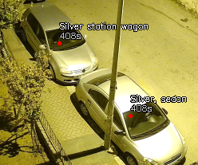

# Machina - Video Surveillance System

A simple-to-use AI-powered video surveillance system that can detect and track objects in real-time from cameras, featuring advanced zoom controls, multiple resolution presets, persistent configuration, and smart frame optimization.



## What does it do?

Machina watches video feeds and automatically detects objects like people, cars, and other things you care about. It keeps track of each object and can record video or take screenshots when needed.

**Key Features:**
- Runs completely offline - no internet required
- Records video and takes snapshots with one key press
- Real-time object detection and tracking using YOLO models
- Advanced zoom and pan controls with smart object tracking
- Crowd detection and clustering algorithms
- Instant replay system with 10-second rolling buffer
- Multiple resolution presets (640x480 to 1920x1080) with keypad shortcuts
- Fullscreen support with aspect ratio preservation
- Military mode for enhanced detection accuracy
- Smart frame skipping and performance optimization
- Dynamic YOLO input size adjustment for optimal performance
- Semi-transparent selection overlay with real-time drawing
- **NEW: Persistent configuration saving** - remembers your settings between sessions
- **NEW: Multi-instance webcam support** - automatically detects and configures multiple webcams
- **NEW: Command-line stream selection** - specify stream source via --stream argument
- **NEW: Audio visualization** - real-time audio waveform display (experimental)
- **NEW: First-run detection** - automatic initial configuration

## Quick Start

1. **Install Python 3.8+** and make sure you have a webcam or camera stream
2. **Download and install:**
```bash
git clone https://github.com/PsyChip/machina
cd machina
pip install -r requirements.txt
```

3. **Torch library should be installed manually:**
```bash
pip uninstall torch torchvision torchaudio
pip install torch torchvision torchaudio --index-url https://download.pytorch.org/whl/cu118
```

4. **Configure your settings:**
Edit the top section of `app.py` to customize:
- YOLO model (default: yolo12n)
- Video source (RTSP URL or webcam)
- Performance settings and thresholds

5. **Run the program:**
```bash
# For webcam (default)
python app.py

# For specific RTSP stream
python app.py --stream "rtsp://your-camera-url"

# For video file
python app.py --stream "path/to/video.mp4"
```

## How to Use

### Setting up your camera
You can specify your video source in multiple ways:

**Option 1: Command line argument (recommended)**
```bash
python app.py --stream 0                      # Webcam
python app.py --stream "rtsp://camera-url"    # IP Camera
python app.py --stream "video.mp4"            # Video file
```

**Option 2: Edit `app.py` configuration**
- **Webcam:** Set `rtsp_stream = 0`
- **IP Camera:** Set `rtsp_stream = "rtsp://your-camera-url"`
- **Video File:** Set `rtsp_stream = "path/to/your/video.mp4"`

### Controls

| Key         | What it does                              |
| ----------- | ----------------------------------------- |
| `Q`         | Quit                                      |
| `R`         | Start/Stop recording                      |
| `S`         | Take screenshot                           |
| `F`         | Reset window to stream resolution         |
| `M`         | Toggle military mode (enhanced detection) |
| `Space`     | Skip frames                               |
| `Backspace` | Toggle replay mode                        |
| `1`         | Resize to 640x480                         |
| `2`         | Resize to 800x600                         |
| `3`         | Resize to 1024x768                        |
| `4`         | Resize to 1280x800                        |
| `5`         | Resize to 1920x1080                       |
| `6`         | Reset to original stream size             |
| `Enter`     | Toggle fullscreen mode                    |
| `Esc`       | Exit fullscreen mode                      |
| `+`         | Decrease frame skip (more processing)     |
| `-`         | Increase frame skip (less processing)     |

**Mouse Controls:**
- **Scroll wheel:** Zoom in/out
- **Right-click + drag:** Move around when zoomed
- **Left-click + drag:** Draw selection box

### What gets detected
By default, Machina looks for daily objects you can see on street: people, cars, motorcycles etc.
You can change what it looks for by editing the `classlist` in `app.py`.

## Saved Files

- **Screenshots:** Saved in `snapshots/` folder
- **Recordings:** Saved in `recordings/` folder
- **Object images:** Saved in `elements/` folder

## Configuration Files

Machina now automatically saves and loads your settings:

### config.json
Stores your application preferences:
- Frame skip setting (processing_nth_frame)
- Screen resolution preference
- Window position
- First run detection flag

### webcam.json
Automatically detects and stores webcam capabilities:
- Webcam fingerprinting for multi-instance support
- Maximum supported resolutions per webcam
- Webcam-specific properties (FPS, brightness, contrast, etc.)
- Testing date and results for each webcam

These files are created automatically on first run and updated when you change settings.

## Troubleshooting

**Program runs slowly?**
- Try pressing `M` to enable military mode for optimized processing
- Make sure you have a graphics card and installed the CUDA version above
- Use number keys (1-6) to adjust resolution for better performance

**Can't connect to camera?**
- Check your camera URL or make sure webcam is plugged in
- Try changing `rtsp_stream = 0` for built-in webcam

**Need help?**
The program shows what it's doing in the terminal window. Look there for error messages.

## Dependencies

### Core Libraries
```
opencv-python==4.10.0.84  # Computer vision operations
ultralytics>=8.3.1        # YOLO model implementation
torch                      # Deep learning framework
scikit-learn              # DBSCAN clustering for crowd detection
numpy                     # Numerical computations
dill>=0.3.9               # Object serialization
pickleshare>=0.7.5        # Caching utilities
```

## Advanced Features

### Persistent Configuration System
- **Automatic Settings Save**: Your preferences are automatically saved to `config.json`
- **Multi-Instance Support**: Each webcam is fingerprinted and configured independently
- **First-Run Detection**: Automatically sets up initial configuration
- **Settings Preserved**: Frame skip, resolution, and window position are remembered

### Zoom and Pan System
- Scroll wheel to zoom in/out (up to 6x zoom)
- Right-click and drag to pan around when zoomed
- Smart object tracking preservation during zoom operations
- Automatic YOLO processing optimization during zoom

### Military Mode
- Enhanced detection mode with grayscale processing
- Optimized for person and vehicle detection
- Reduced frame skipping for maximum accuracy
- Toggle with `M` key

### Replay System
- Automatic 10-second rolling buffer (~300 frames at 30fps)
- Instant replay with `Backspace` key
- Visual "REPLAY" indicator during playback
- No YOLO processing during replay for smooth playback

### Resolution Management
- Multiple preset resolutions (640x480 to 1920x1080)
- Dynamic YOLO input size adjustment
- Fullscreen support with aspect ratio preservation
- Original stream size restoration
- Automatic webcam maximum resolution detection

### Frame Skip Control
- Dynamic frame skip adjustment with `+` and `-` keys
- Visual feedback when changing skip settings
- Automatic saving of preferred skip rate
- Intelligent skip adjustment based on performance

### Audio Features (Experimental)
- Real-time audio waveform visualization
- Audio stream capture from video sources
- Configurable waveform display settings
- Mute/unmute capability
- Automatic audio detection and initialization

## System Requirements

- Python 3.8+
- CUDA compatible GPU with at least 2GB VRAM (Developed on NVIDIA RTX 2060)
- At least 16GB RAM, 32GB recommended to run in background

## Recent Updates

### Latest Changes
- **Settings Persistence**: Application now saves and restores your settings automatically
- **Multi-Instance Support**: Each webcam is uniquely identified and configured
- **Command-Line Arguments**: Stream source can be specified via --stream argument
- **Enhanced Resolution Control**: Better keypad controls for resolution switching
- **Automatic Configuration**: First-run detection and setup
- **Improved Frame Skip**: Dynamic adjustment with visual feedback

---
- Curated by **PsyChip** for experimental purposes